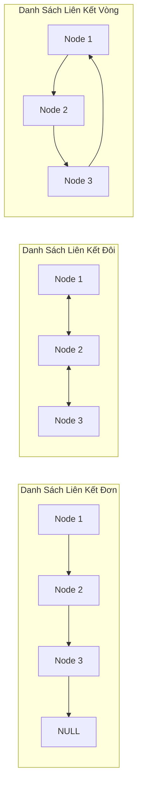

# Kiến Thức Nền Tảng - Chương 2: Các Kiểu Dữ Liệu Trừu Tượng Cơ Bản

Tài liệu này hệ thống hóa toàn diện các nguyên lý lý thuyết, mô hình kiến trúc dữ liệu và giải thuật nền tảng cần thiết để nắm vững và giải quyết toàn bộ 24 bài tập (lý thuyết & thực hành) trong **Chương 2: Các kiểu dữ liệu trừu tượng cơ bản**.

---

## 1. Khái Niệm Kiểu Dữ Liệu Trừu Tượng (Abstract Data Type - ADT)

### 1.1. Định nghĩa
- **Kiểu dữ liệu trừu tượng (ADT):** Là một mô hình toán học bao gồm:
  1. Một tập hợp các giá trị dữ liệu (Data domain).
  2. Một tập hợp các phép toán (Operations) được định nghĩa trên tập giá trị đó.
- **Nguyên lý đóng gói và trừu tượng hóa:** ADT chỉ quy định **"LÀM GÌ" (Giao diện - Interface / Specification)** mà hoàn toàn ẩn giấu **"LÀM NHƯ THẾ NÀO" (Cài đặt - Implementation)** đối với người sử dụng.
- **Lợi ích:**
  - Tách biệt mã nguồn ứng dụng khỏi chi tiết cấu trúc bộ nhớ.
  - Cho phép thay đổi giải thuật hoặc cấu trúc lưu trữ bên dưới mà không làm ảnh hưởng đến mã nguồn tầng trên.

---

## 2. So Sánh Mảng (Array) và Danh Sách Liên Kết (Linked List)

### 2.1. Cấu trúc Mảng (Array)
- **Đặc điểm:** Các phần tử cùng kiểu được cấp phát trong một vùng nhớ **liên tục** (contiguous memory).
- **Ưu điểm:**
  - Truy xuất ngẫu nhiên (Random access) tới phần tử thứ $i$ cực nhanh với chi phí $O(1)$ thông qua công thức địa chỉ: $\text{Address}(A[i]) = \text{Base} + i \times \text{sizeof(Type)}$.
  - Tiết kiệm bộ nhớ vì không cần lưu trữ thêm biến con trỏ.
- **Nhược điểm:**
  - Kích thước cố định (đối với mảng tĩnh) hoặc chi phí tái cấp phát đắt đỏ khi mảng đầy (đối với mảng động, phải copy toàn bộ sang vùng nhớ mới).
  - Thao tác chèn hoặc xóa phần tử ở vị trí bất kỳ tốn chi phí $O(n)$ vì phải dời chỗ (shift) các phần tử phía sau.
  - Có thể gây lãng phí bộ nhớ nếu cấp phát kích thước tối đa quá lớn.

### 2.2. Danh sách liên kết (Linked List)
- **Đặc điểm:** Mỗi phần tử (Nút - Node) là một khối nhớ rời rạc chứa hai thành phần: Dữ liệu (Data) và Con trỏ liên kết (Pointer/Link) trỏ đến nút kế tiếp.
- **Ưu điểm:**
  - Cấp phát động linh hoạt tại thời điểm chạy: kích thước tăng giảm tùy ý, không lo tràn bộ nhớ chừng nào RAM còn trống.
  - Chèn và xóa một nút tại vị trí đã xác định chỉ mất thời gian $O(1)$ (chỉ cần điều chỉnh lại các liên kết con trỏ, không phải dời dữ liệu).
- **Nhược điểm:**
  - Không hỗ trợ truy xuất ngẫu nhiên: để đến phần tử thứ $i$ phải duyệt tuần tự từ đầu với chi phí $O(n)$.
  - Tốn thêm bộ nhớ để lưu biến con trỏ (`next`, `prev`).
  - Phân mảnh bộ nhớ (Memory fragmentation) và hiệu năng cache (Locality of reference) kém hơn mảng.

### 2.3. Bảng so sánh tổng hợp độ phức tạp thuật toán
| Cấu trúc dữ liệu | Truy xuất ngẫu nhiên | Chèn / Xóa đầu | Chèn / Xóa cuối | Chèn / Xóa giữa (khi đã có con trỏ) | Tìm kiếm giá trị | Bộ nhớ phụ trợ |
| :--- | :---: | :---: | :---: | :---: | :---: | :---: |
| **Mảng (Array)** | $O(1)$ | $O(n)$ | $O(1)^*$ | $O(n)$ | $O(n)$ (hoặc $O(\log n)$ nếu đã sắp xếp) | $0$ byte |
| **DSLK đơn (SLL)** | $O(n)$ | $O(1)$ | Chèn: $O(1)^{**}$ / Xóa: $O(n)$ | Chèn sau: $O(1)$ / Xóa: $O(n)$ | $O(n)$ | 1 con trỏ / Node |
| **DSLK đôi (DLL)** | $O(n)$ | $O(1)$ | $O(1)^{**}$ | $O(1)$ (cả chèn trước và sau, xóa nút) | $O(n)$ | 2 con trỏ / Node |
| **DSLK vòng (CLL)**| $O(n)$ | $O(1)$ | $O(1)$ (với con trỏ đuôi Tail) | $O(1)$ (đối với vòng đôi) | $O(n)$ | 1 hoặc 2 con trỏ |

*\* Với mảng động, chèn cuối có chi phí khấu hao (Amortized) $O(1)$.*  
*\*\* Yêu cầu duy trì con trỏ quản lý `pTail` trỏ vào cuối danh sách.*

---

## 3. Các Biến Thể Của Danh Sách Liên Kết



### 3.1. Danh sách liên kết đơn (Singly Linked List - SLL)
- Mỗi Node gồm: `Data` và con trỏ `pNext`.
- Con trỏ `pHead` trỏ vào nút đầu tiên, nút cuối có `pNext = NULL`.
- Phù hợp với các bài toán duyệt xuôi, thao tác nhiều ở đầu danh sách hoặc chèn cuối khi có `pTail`.

### 3.2. Danh sách liên kết đôi (Doubly Linked List - DLL)
- Mỗi Node gồm: `Data`, con trỏ tiến `pNext`, và con trỏ lùi `pPrev`.
- Cho phép duyệt hai chiều (xuôi và ngược) dễ dàng.
- Cho phép **xóa một nút bất kỳ trong $O(1)$** khi đã có con trỏ trỏ tới nút đó:
  ```cpp
  p->prev->next = p->next;
  p->next->prev = p->prev;
  delete p;
  ```

### 3.3. Danh sách liên kết vòng (Circular Linked List - CLL)
- Nút cuối cùng của danh sách trỏ ngược về nút đầu tiên thay vì trỏ tới `NULL`.
- Không có nút kết thúc; có thể bắt đầu duyệt từ bất kỳ nút nào và đi qua toàn bộ danh sách.
- **Ứng dụng tiêu biểu:**
  - Thuật toán điều phối luân phiên CPU (Round-Robin Scheduling).
  - Bài toán Josephus (vòng tròn loại trừ).

---

## 4. Ngăn Xếp (Stack) và Hàng Đợi (Queue)

### 4.1. Ngăn xếp (Stack - LIFO: Last In, First Out)
- Phần tử đưa vào cuối cùng sẽ là phần tử đầu tiên được lấy ra.
- **Các thao tác cơ bản:**
  - `push(x)`: Đẩy phần tử $x$ vào đỉnh ngăn xếp ($O(1)$).
  - `pop()`: Lấy và xóa phần tử ở đỉnh ngăn xếp ($O(1)$).
  - `top()` / `peek()`: Đọc giá trị phần tử đỉnh mà không xóa ($O(1)$).
  - `isEmpty()`: Kiểm tra ngăn xếp rỗng ($O(1)$).

### 4.2. Hàng đợi (Queue - FIFO: First In, First Out)
- Phần tử đưa vào đầu tiên sẽ là phần tử đầu tiên được lấy ra.
- **Các thao tác cơ bản:**
  - `enqueue(x)`: Đưa phần tử $x$ vào cuối hàng đợi ($O(1)$).
  - `dequeue()`: Lấy và xóa phần tử ở đầu hàng đợi ($O(1)$).
  - `front()`: Đọc giá trị phần tử đầu ($O(1)$).
  - `isEmpty()`: Kiểm tra hàng đợi rỗng ($O(1)$).

### 4.3. Ứng dụng nổi bật của Stack trong tính toán biểu thức
1. **Chuyển đổi biểu thức Trung tố (Infix) sang Hậu tố (Postfix) - Thuật toán Shunting-Yard (Edsger Dijkstra):**
   - Đọc từng token từ trái sang phải:
     - Nếu là toán hạng (số): Ghi thẳng ra đầu ra.
     - Nếu là hàm (`sin`, `cos`...): Đẩy vào Stack toán tử.
     - Nếu là dấu mở ngoặc `(`: Đẩy vào Stack.
     - Nếu là dấu đóng ngoặc `)`: Lần lượt pop toán tử từ Stack ra đầu ra cho đến khi gặp `(`. Bỏ dấu `(`.
     - Nếu là toán tử: Pop các toán tử có độ ưu tiên cao hơn hoặc bằng từ Stack ra đầu ra, sau đó đẩy toán tử hiện tại vào Stack.
   - Khi hết biểu thức: Pop toàn bộ toán tử còn lại trong Stack ra đầu ra.
2. **Tính giá trị biểu thức Hậu tố (Postfix Evaluation):**
   - Đọc từ trái sang phải: gặp toán hạng thì push vào Stack; gặp toán tử thì pop 2 toán hạng từ Stack, tính kết quả rồi push lại vào Stack.

---

## 5. Cấu Trúc Dữ Liệu Chuyên Biệt Cho Các Bài Toán Điển Hình

### 5.1. Biểu diễn và xử lý Đa thức (Polynomial ADT)
- Một đa thức $P(x) = c_1 x^{e_1} + c_2 x^{e_2} + \dots + c_k x^{e_k}$ được biểu diễn bằng một danh sách liên kết.
- Mỗi Node lưu: `float heSo` (hệ số) và `int soMu` (số mũ).
- Danh sách được duy trì sắp xếp giảm dần theo số mũ để tối ưu hóa việc cộng, trừ hai đa thức (giống như thuật toán trộn hai danh sách có thứ tự với chi phí $O(n + m)$).
- **Thuật toán Horner:** Tính giá trị $P(x_0)$ hiệu quả bằng cách biến đổi dạng lồng nhau:
  $$P(x) = (\dots((a_n x + a_{n-1})x + a_{n-2})x + \dots + a_0)$$

### 5.2. Biểu diễn Ma trận thưa (Sparse Matrix)
- **Định nghĩa:** Ma trận thưa là ma trận có đại đa số phần tử bằng 0. Nếu dùng mảng 2 chiều $M \times N$ sẽ gây lãng phí bộ nhớ nghiêm trọng ($O(M \times N)$).
- **Giải pháp DSLK:** Chỉ lưu các phần tử khác 0 dưới dạng bộ ba (Triple):
  ```cpp
  struct Element {
      int row;    // Chỉ số hàng (0-based)
      int col;    // Chỉ số cột (0-based)
      double val; // Giá trị phần tử != 0
      Element* next;
  };
  ```
- **Kiểm tra đường chéo:**
  - Đường chéo chính của ma trận vuông cấp $n$: các phần tử có $\text{row} == \text{col}$.
  - Đường chéo phụ của ma trận vuông cấp $n$: các phần tử có $\text{row} + \text{col} == n - 1$.

### 5.3. Cấu trúc bộ nhớ cho Trình soạn thảo văn bản (Text Editor Buffer)
- Văn bản gồm nhiều dòng, số lượng dòng không giới hạn. Mỗi dòng có tối đa 80 ký tự.
- **Cấu trúc dữ liệu tối ưu:**
  - Cấu trúc dòng (`LineNode`): Sử dụng **Danh sách liên kết đôi (DLL)** để liên kết các dòng. Mỗi dòng chứa một mảng ký tự `char text[81]` và con trỏ `prev`, `next`.
  - Con trỏ định vị (Cursor): Quản lý con trỏ dòng hiện tại `currentLine` và vị trí cột `colPos`.
  - **Lý do chọn DLL:** Di chuyển con trỏ lên/xuống nhanh chóng ($O(1)$), chèn dòng mới hoặc xóa dòng chỉ mất $O(1)$ mà không cần dời chỗ toàn bộ văn bản trong bộ nhớ.

### 5.4. Cấu trúc Cây Thực đơn Đa cấp (Hierarchical Menu)
- Văn bản thụt đầu dòng (indentation) mô tả mối quan hệ cha - con giữa các mục thực đơn.
- Mô hình hóa bằng **Cây đa phân (N-ary Tree)** thông qua kỹ thuật con trỏ **Con đầu - Em kề (First Child - Next Sibling)**:
  ```cpp
  struct MenuItem {
      char title[100];
      bool isPopup;
      MenuItem* firstChild;  // Con đầu tiên
      MenuItem* nextSibling; // Mục ngang cấp kế tiếp
  };
  ```

### 5.5. Số học độ chính xác lớn (Arbitrary-Precision Arithmetic / BigNum)
- Để biểu diễn các số nguyên lớn đến 30 chữ số (vượt quá giới hạn của `unsigned long long` 64-bit tối đa 19 chữ số):
- Biểu diễn số dưới dạng mảng các chữ số hoặc DSLK đơn/đôi lưu từng chữ số (hoặc khối 4-9 chữ số theo hệ cơ số $10^4$ hay $10^9$).
- Cài đặt phép cộng, trừ, nhân, chia mô phỏng thuật toán đặt tính theo cột dọc trong số học tiểu học.

---

## 6. Tài Liệu Tham Khảo (References & Citations)

1. **Mark Allen Weiss (2013).**
   *Data Structures and Algorithm Analysis in C++*, 4th Edition, Pearson.
   - Chapter 3: *Lists, Stacks, and Queues* (Cài đặt ADT List, Stack, Queue, Đánh giá biểu thức).
2. **Alfred V. Aho, John E. Hopcroft, Jeffrey D. Ullman (1983).**
   *Data Structures and Algorithms*, Addison-Wesley.
   - Chapter 2: *Basic Abstract Data Types*.
3. **Edsger W. Dijkstra (1961).**
   *Algol 60 translation: An algol 60 translator for the x1 and Making a translator for ALGOL 60*, Mathematisch Centrum, Amsterdam. (Gốc gác thuật toán Shunting-yard).
4. **Đỗ Xuân Lôi (2007).**
   *Cấu trúc dữ liệu và giải thuật*, Nhà xuất bản Đại học Quốc gia Hà Nội.
   - Chương 2: *Các cấu trúc dữ liệu cơ bản: Danh sách, Ngăn xếp, Hàng đợi*.
5. **GeeksforGeeks (2024).**
   *Linked List Data Structure, Stack Data Structure, Infix to Postfix Conversion*.
   - URL: `https://www.geeksforgeeks.org/data-structures/`
